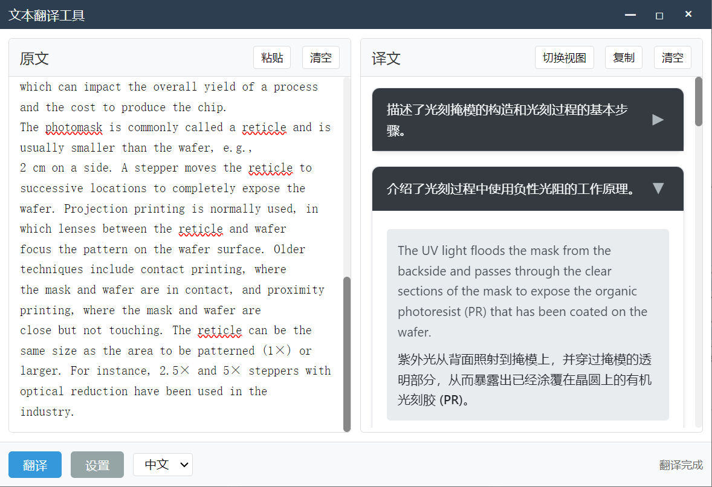

# 文本翻译工具

一个基于 Electron 开发的跨平台文本翻译工具，支持快捷键调用、AI 智能分段等功能。





## ✨ 特性

- 🚀 快速翻译：支持快捷键呼出翻译窗口
- 🤖 AI 智能分段：自动识别文本段落，优化阅读体验
- 📋 快捷操作：一键复制、粘贴、清空
- 🎨 双语对照：支持原文/译文切换显示
- ⌨️ 全局快捷键：随时随地快速调用
- 🔒 数据安全：本地加密存储 API Key

## 🛠️ 技术栈

- Electron
- Node.js
- 彩云小译 API
- OpenAI API

## 📦 安装

```bash
# 克隆项目
git clone https://github.com/yourusername/translator.git

# 安装依赖
cd translator
npm install

# 启动开发环境
npm start

```
~~# 打包应用~~
~~npm run build~~


## 🚀 使用说明
### 基本翻译
1. 在左侧输入框中输入或粘贴要翻译的文本
2. 点击"翻译"按钮或~~使用快捷键 Ctrl + Enter(TODO)~~
3. 在右侧查看翻译结果
### 快捷翻译
1. 选中任意文本
2. 复制文本内容（快捷键 Ctrl + C）
3. 按下快捷键 Ctrl + O （可在设置中修改）
4. 自动弹出翻译窗口显示结果
### AI 智能分段
1. 在设置中启用 AI 分段功能
2. 配置 AI 提供商和 API Key
3. 翻译时自动进行智能分段
## ⚙️ 配置说明
### API 配置
- 彩云小译 API Token：用于基础翻译功能
- AI API Key：用于智能分段功能（支持 ~~DeepSeek~~/智谱）
### 快捷键设置
- 翻译窗口：默认 Ctrl + O
- ~~输入窗口：默认 Ctrl + X~~
## 🗺️ 开发路线
### 已实现功能
- 基础文本翻译
- AI 智能分段
- 全局快捷键
- 配置持久化
- API Key 加密存储
### 开发计划
- PDF 文件翻译
- OCR 图片翻译
- 历史记录功能
- 离线翻译支持
- 多语言支持
- 自定义主题
- 批量翻译
- 导出功能（Word/PDF）
## 🤝 贡献指南
欢迎提交 Issue 和 Pull Request！

1. Fork 本仓库
2. 创建特性分支： git checkout -b feature/AmazingFeature
3. 提交改动： git commit -m 'Add some AmazingFeature'
4. 推送分支： git push origin feature/AmazingFeature
5. 提交 Pull Request
## 📄 许可证
本项目基于 MIT 许可证开源 - 查看 LICENSE 文件了解更多细节

## 🙏 致谢
- Electron
- 彩云小译
- DeepSeek
- 智谱 AI